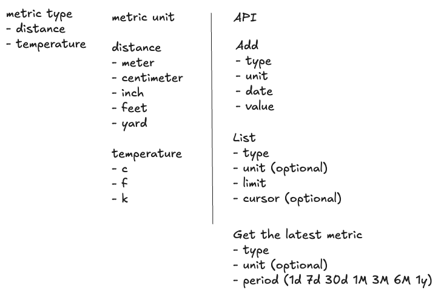
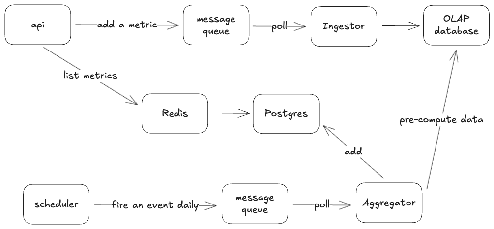

# Everfit Interview

## Introduction
Build a Metric tracking system that support different units with TypeScript, Express, PostgreSQL, following monorepo structure.

### Draft Requirements

From requirements to a draft:



### Project Structure
```
.
├── __tests__              # Integration tests
└── services/api           # API service
    └── src
        ├── api            # Route handlers
        ├── dto            # Input validation
        ├── models         # Database models
        ├── repositories   # Database layer
        └── services       # Business logic layer
```

### Features
- Add new metric
- List metrics
- List latest metrics

## Starting project

### Docker

1. Start all services:
```bash
make compose-all
```

2. Run integration tests:
```bash
make test-integration
```

3. Shutdown all services:
```bash
make compose-down
```

### Sample `cURL` commands
1. Add new metric
```bash
curl --location 'http://localhost:3000/metrics' \
--header 'Content-Type: application/json' \
--data '{
    "userId": "550e8400-e29b-41d4-a716-446655440000",
    "type": "temperature",
    "value": 1200,
    "unit": "k",
    "date": "2025-08-16"
  }'
```

Response:
```json
{
    "id": "0198f462-e4cd-7519-b5ab-7d2a46ba87d9",
    "userId": "550e8400-e29b-41d4-a716-446655440000",
    "type": "temperature",
    "value": 1200,
    "unit": "k",
    "date": "2025-08-16T00:00:00.000Z",
    "createdAt": "2025-08-29T05:52:58.573Z"
}
```

2. List metrics
```bash
curl --location 'http://localhost:3000/metrics?userId=550e8400-e29b-41d4-a716-446655440000&type=temperature&limit=2&unit=c'
```

Response:
```json
{
    "data": [
        {
            "id": "0198f465-e3e2-75b9-a12e-75df7a61923e",
            "type": "temperature",
            "value": 926.85,
            "unit": "c",
            "date": "2025-08-16T00:00:00.000Z",
            "createdAt": "2025-08-29T05:56:14.946Z"
        },
        {
            "id": "0198f465-a7c3-772a-9404-f5d3cfc89f34",
            "type": "temperature",
            "value": 926.85,
            "unit": "c",
            "date": "2025-08-16T00:00:00.000Z",
            "createdAt": "2025-08-29T05:55:59.555Z"
        }
    ],
    "nextCursor": "0198f465-a7c3-772a-9404-f5d3cfc89f34"
}
```

3. List latest metrics
```bash
curl --location 'http://localhost:3000/metrics/latestPerDay?userId=550e8400-e29b-41d4-a716-446655440000&type=temperature&period=30d&unit=c'
```

Response:
```json
[
    {
        "id": "0198f465-e3e2-75b9-a12e-75df7a61923e",
        "type": "temperature",
        "value": 926.85,
        "unit": "c",
        "date": "2025-08-16T00:00:00.000Z",
        "createdAt": "2025-08-29T05:56:14.946Z"
    }
]
```

## Improvements

For the future scaling, I'm into dividing the `api` service into multiple components:
- `api`: Serve frontend calls
- `ingestor`: To avoid losing metric, this service polls from a message queue and then ingest data to an OLAP database (e.g: Redshift)
- `scheduler`: Fire an event daily to trigger `aggregator`
- `aggregator`: Pre-compute historical data from the OLAP database, then add to Postgres to improve querying speed.

